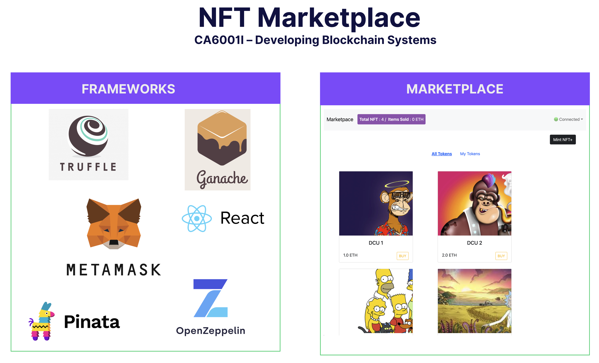

# CA6001I_Assignment1

Welcome to our NFT Marketplace Project, a decentralized platform for buying, selling, and trading Non-Fungible Tokens (NFTs). The projects leverages blockchain technology to provide a secure and transparent environment for artists and collectors.

## Prerequisites

 Before you begin, ensure you have the following installed on your system: -  
**Node.js**: Required to run the project locally and manage dependencies. -  
**MetaMask**: A browser extension or mobile app that allows you to interact with the Ethereum blockchain. 

### Installing Node.js Visit 
[Node.js's official website](https://nodejs.org/) and download the latest LTS version for your operating system. Follow the installation instructions for your platform. To verify the installation, open a terminal or command prompt and run: 

```bash
node --version 
npm --version
```
### MetaMask
1.  Download MetaMask from the [official website](https://metamask.io/) or your browser's extension store.
2.  Follow the instructions to create a new wallet or import an existing one.
3.  Ensure you're connected to the Ethereum network or the specific blockchain network your project uses.


## Setup
Follow these steps to get your local environment set up:

1.  **Clone the Repository**
```bash
git clone https://github.com/mvieiradcu/CA6001II_Assignment1
cd [your-project-directory]
```
2.  **Create Etherscan credential file**
Create a file named `.etherscan_key` on the root of the project. This file contains the API Key to access  [Etherscan](https://etherscan.io/login).
```plaintext
<CHANGE_TO_ETHERSCAN_API_KEY>
```
3.  **Create Infura credential file**
Create a file named `.infura_key` on the root of the project. This file contains the API Key to access  [Infura](https://www.infura.io/).
```plaintext
<CHANGE_TO_INFURA_API_KEY>
```
4.  **Create Wallet Mnmemonic file**
Create a file named `.secret` on the root of the project. This file contains the wallet mnemonic. 
This value can be found on Ganache. 
```plaintext
<CHANGE_TO_WALLET_MNEMONIC>
```
5.  **Create Pinata credentials file**
Create a file named `.env` on the `client` directory of the project. This file contains the credentials to access [Pinata](https://www.pinata.cloud/).
```plaintext
REACT_APP_PINATA_API_KEY="<CHANGE_TO_API_KEY>"
REACT_APP_PINATA_SECRET_API_KEY="<CHANGE_TO_SECRET_API_KEY>"
REACT_APP_PINATA_SECRET_ACCESS_TOKEN=<CHANGE_TO_JWT_SECRET>
```
5.  **Install Ganache**
For Ganache installation follow the steps in the [Ganache](https://archive.trufflesuite.com/ganache/)
 official website  
 
6.  **Install Dependencies for the smart contract deploy**
Inside the project directory, run:
```bash
npm install
npx truffle migrate --network ganache --reset
```
7.  **Install the client dependencies**
Inside the client directory execute the commands below
```bash
npm install
npx truffle migrate --network ganache --reset
```
8.  **Start React application** 
```bash
npm start
```
Open [http://localhost:3000](http://localhost:3000) to view it in your browser.


